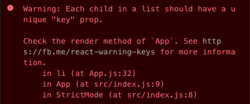
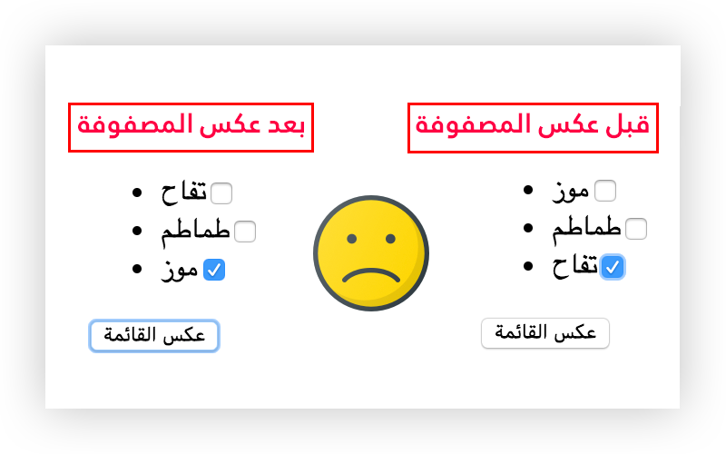
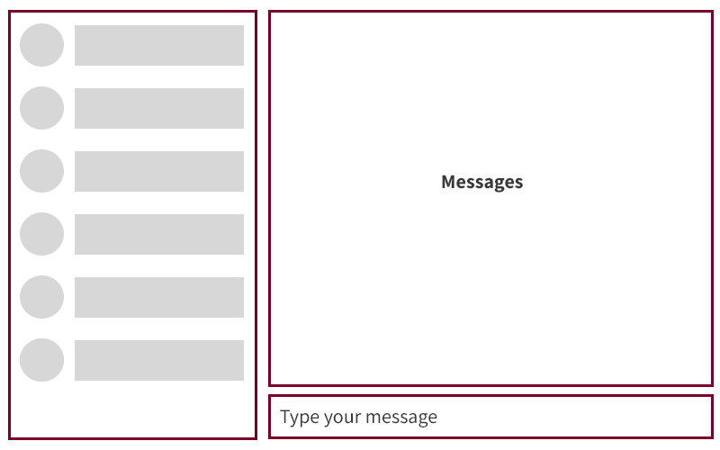

إذا كنت من مستعملي مكتبة React في بناء تطبيقات الويب فلا شك بأن التنبيه في الصورة التالية قد ظهر لك من قبل في شاشة الكونسول:



يظهر التنبيه على الخصوص عندما نحاول عرض قائمة من العناصر انطلاقا من مصفوفة عن طريق الوظيفة `map()`. هذه العملية واردة جدا ومتكررة في أغلب تطبيقات رياكت مهما كانت بسيطة، وعندها يُطلب منا بإلحاح أن نقوم بإضافة خاصية اسمها `key` لأي عنصر من تلك القائمة.

**إذن ما أهمية هذه الخاصية بالنسبة لرياكت ؟ وما الدور الذي تلعبه ؟**

عندما يتم إجراء تحديث على مستوى **حالة** مكون من مكونات التطبيق فإن رياكت ستعيد عملية `render` الخاصة بذلك المكون، ما يعني إنشاء شجرة جديدة من العناصر على شكل Virtual DOM. هذه الشجرة تكون مختلفة بطبيعة الحال عن الشجرة الموجودة قبل إجراء عملية التحديث على `state`. في تلك اللحظة تحتاج مكتبة React لمعرفة الفوارق بين الشجرة القديمة والجديدة لتحديد التغييرات (Mutations) التي سيتم تطبيقها على واجهة المستخدم (UI) مع ضمان أقصى درجات الفعالية والأداء.

## ما دخل Key prop في هذا ؟

بحسب [التوثيق الرسمي](https://ar.reactjs.org/docs/lists-and-keys.html#keys) لرياكت:

> تُساعِد المفاتيح React على **معرفة** العناصر التي **تغيرت، أو أُضيفت، أو أُزيلت**. يجب أن تُعطَى المفاتيح للعناصر بداخل المصفوفة وذلك لإعطاء هذه العناصر **هوية** مستقرة.

لكي نفهم هذا الكلام بشكل جيد، دعونا نتخيل بأنه لدينا قائمة من عنصرين اثنين:

```html
<li>العنصر 1</li>
<li>العنصر 2</li>
```

لنفترض بأنه أضفنا عنصرا **ثالثا** لتلك القائمة:

```html{3}
<li>العنصر 1</li>
<li>العنصر 2</li>
<li>العنصر 3</li>
```

سيكون على رياكت الآن أن تعمل مقارنة بين القائمتين لمعرفة الفوارق بينها. في هذا المثال سيتم التوصل إلى أن الفرق هو **العنصر الثالث** الذي تمت إضافته، وبناء على ذلك سيتم إجراء تغيير على واجهة المستخدم بإضافة **ذلك العنصر فقط**.

إلى هنا لا يوجد أي مشكل 😙

دعونا نضيف **عنصر رابع** إلى قائمتنا 😃 ولكن هذه المرة إلى **بدايتها**.

```html{1}
<li>العنصر 4</li>
<li>العنصر 1</li>
<li>العنصر 2</li>
<li>العنصر 3</li>
```

هذه المرة ستخلص المقارنة إلا أن العنصر الأول القديم (العنصر 1) مختلف عن العنصر الأول الجديد (العنصر 4)، والعنصر الثاني القديم (العنصر 2) مختلف عن الثاني الجديد (العنصر1) ... وهكذا حتى يتم المرور على كافة العناصر واعتبار أن القائمة كلها مختلفة عما كانت عليه، فيتم إجراء تحديث عليها بالكامل عوض إجرائه على العنصر الذي تمت إضافته **فقط** (العنصر 4).

هذا يعتبر مشكلا يمس بشكل مباشر أداء وفعالية التطبيق، والسبب أن رياكت في حاجة إلى طريقة تمكنها من **تحديد هوية** كل عنصر من عناصر القائمة لإيجاده **حتى ولو تغير مكانه**.

### الحل

الحل هو في استخدام الخاصية `key` لتحديد هوية كل عنصر والرجوع إليها بعد كل عملية تصيير (Rendering) للمكون.

فإذا أخذنا المثال السابق وأضفنا إلى كل عنصر `li` المفتاح `key` سيكون لدينا ما يلي:

```html
<li key="236d907b">العنصر 4</li>
<li key="cf36d8f5">العنصر 1</li>
<li key="fa17a05e">العنصر 2</li>
<li key="8ef0fe69">العنصر 3</li>
```

هنا عوض الإعتماد على المقارنة بين العناصر بحسب ترتيب عرضها ستتم المقارنة **بالإعتماد على المفتاح** الممرر إلى الخاصية `key`، وفي مثالنا ستعرف رياكت بأن **العناصر 1، 2 و 3** موجودة من قبل وكل ما وقع أنه **تم تغيير مكانها**. ستعلم كذلك أن `العنصر 4` **مستجد** في القائمة بما أنه لم يتم إيجاد أي عنصر يحمل ذلك المفتاح في **النسخة السابقة** من شجرة Virtual DOM.

## هذا ليس كل شيء

رأينا إذن كيف أن استعمال خاصية المفتاح يساعد كثيرا رياكت في القيام بعملها بأداء وفعالية أكبر. ولكن هذا ليس الدور الوحيد الذي تلعبه ..

سنرى فيما يلي أن هذا المفتاح يستعمل **لربط كل عنصر بحالته** الخاصة `state` لا سيما عند وجود عنصر غير متحكم فيه (Uncontrolled) مثل `input`.

لكي يتضح لنا معنى هذا الكلام بشكل جيد سنأخذ هذا المثال البسيط:

```jsx
import React from 'react';

const initialList = ['موز', 'طماطم', 'تفاح'];

export default function App() {
  const [list, setList] = React.useState(initialList);

  function reverseList() {
    setList(list.slice().reverse());
  }

  return (
    <>
      <ul>
        {list.map((item, index) => (
          <li>
            {item}
            <input type="checkbox" />
          </li>
        ))}
      </ul>
      <button onClick={reverseList}>عكس القائمة</button>
    </>
  );
}
```

في هذ المكون لدينا مصفوفة من ثلاثة فواكه:

- موز
- طماطم
- تفاح

يقوم المكون بعرض ثلاثة عناصر `li` انطلاقا من المصفوفة `list`. في كل عنصر `li` نجد اسم الفاكهة وبجانبها حقل من نوع `checkbox`.

عندما نقوم باختيار إحدى الفواكه عن طريق `checkbox` ـ مثلا تفاح ـ ثم نقوم بعكس ترتيب المصفوفة بالنقر على `button`، نلاحظ بأن عملية العكس أو القلب تتم بنجاح ولكن `checkbox` النشيط يظل في مكانه ولم يستجب لعملية `reverse`. هذا سبب مشكلا كبيرا في واجهة المستخدم بحيث يظهر لنا أننا اخترنا الموز (الذي أصبح في المؤخرة بعد العكس) وهذا غير صحيح لأن الفاكهة التي اخترناها كانت التفاح!



**لماذا هذا التخبط ؟**

الحقيقة أن رياكت اعتمد على مؤشر `index` لكل عنصر `li` حتى يتم حفظ الحالة الخاصة بالعناصر مثل `checkbox` الموجودة بداخله بين كل عملية **تصيير** (Rendering) وأخرى.

في هذه الحالة فهمت رياكت أن العنصر صاحب المؤشر `2` هو الذي يضم `checkbox` النشيط، وبالتالي بعد عملية `reverse()` أبقت هذا الأخير في نفس المكان حيث المؤشر يساوي `2`، فهي **لا تملك أي آلية تمكنها من تتبع حركة تلك العناصر وتغير مؤشراتها**.

رياكت في هذا المثال **لا يعنيها إن كنا قد عكسنا أو حذفنا جزءًا من المصفوفة ما دمنا لم نستخدم المفتاح `key`**.

بتعبير آخر، رياكت تطلب منا **مساعدتها في تحديد هوية كل عنصر** من العناصر التي ننشئها من المصفوفات عن طريق تعييين مفتاح لكل عنصر. إذا لم نقم بذلك، فإن React تستعين بالمؤشرات (indexes)، وهو أمر لا بأس به ما دمنا متأكدين من أن كل عنصر سيظل محتفظا بمؤشره، أي أنه لن يتم حذفه أو تحريكه كما في مثالنا.

لاحظ خلاصة ما قلنا في هذا الكود الذي حصلنا عليه من [الشفرة المصدرية لمكتبة React.js](https://github.com/facebook/react/blob/master/packages/react-reconciler/src/ReactChildFiber.new.js).

```ts{13,15}
function mapRemainingChildren(
  returnFiber: Fiber,
  currentFirstChild: Fiber
): Map<string | number, Fiber> {
  // Add the remaining children to a temporary map so that we can find them by
  // keys quickly. Implicit (null) keys get added to this set with their index
  // instead.
  const existingChildren: Map<string | number, Fiber> = new Map();

  let existingChild = currentFirstChild;
  while (existingChild !== null) {
    if (existingChild.key !== null) {
      existingChildren.set(existingChild.key, existingChild);
    } else {
      existingChildren.set(existingChild.index, existingChild);
    }
    existingChild = existingChild.sibling;
  }
  return existingChildren;
}
```

إذن لحل المشكل في المثال الذي قدمناه، يجب أن نعين مفتاحا لكل عنصر بشرط ألا نعتمد على `index` لفعل ذلك، بل على **معرف** يكون خاصا بكل عنصر على حدة، ويشترط أن يكون معرفا **ثابتا وغير متغير**.

في المشاريع الحقيقية يكون هذا المفتاح عبارة عن `id` الخاص بهذا العنصر والذي نحصل عليه من قاعدة البيانات.

لمحاكاة ذلك، سنقوم بتغيير شكل مصفوفة الفواكه إلى ما يلي:

```js
const initialList = [
  { id: 'fghdfjk', name: 'موز' },
  { id: 'khadiuy', name: 'طماطم' },
  { id: 'cacsdfd', name: 'تفاح' }
];
```

والآن سنضيف المفتاح `key` إلى العناصر `li` بهذه الطريقة:

```jsx{3,4}
{
  list.map(item => (
    <li key={item.id}>
      {item.name}
      <input type="checkbox" />
    </li>
  ));
}
```

هكذا تم حل المشكل، وأصبح الحقل `checkbox` يتحرك بشكل صحيح مع الفاكهة التي بجانبه 👍


## حالة أخرى

**استعمال خاصية المفتاح لا تقتصر على الحالة التي نقوم فيها بعرض عناصر مصفوفة كما رأينا لحد الآن**، بل هي خاصية يمكن استعمالها في أي مكون رياكت لتحديد هويته بشكل صريح ونخبر رياكت بعد كل عملية تصيير أن عليها تحديث حالة ذلك المكون (إذا تغيرت قيمة المفتاح) وذلك بإنشاء نسخة أخرى منه ونسيان النسخة القديمة.

ودائما لكي نفهم الكلام النظري بشكل جيد، سنستعين بمثال ملموس.

لنفرض أنه لدينا تطبيق للدردشة مثل فيسبوك ميسنجر. في جانب من الشاشة لدينا جهات الإتصال، وفي الجانب الأكبر لدينا محتوى الدردشة. وفي الأسفل لدينا حقل `textarea` لكتابة الرسالة.

عند النقر على جهة اتصال معينة فإنها تصبح نشيطة فيتغير محتوى الدردشة.



```jsx
class ChatApp extends React.Component {
  state = {
    activeChat: null
  };
  render() {
    return (
      <div>
        <ChatList onClick={chat => this.setState({ activeChat: chat })} />
        <Chat activeChat={this.state.activeChat} />
      </div>
    );
  }
}
class ChatList extends React.Component {
  // ...
}
class Chat extends React.Component {
  state = {
    message: ''
  };
  render() {
    if(!this.props.activeChat) return null;
    return (
      <div>
        {this.props.activeChat.messages.map(m => (
          /* render messages */
        )}
        <textarea value={this.state.message} />
      </div>
    );
  }
}
```

الحكاية هنا عندما نكون في دردشة مع صديق ونبدأ في الكتابة في `textarea`، ثم في هذه اللحظة نقرر الإنتقال إلى دردشة مع صديق آخر. المشكل الصغير أن الدردشة تتغير فعلا ولكن النص الذي كتبناه في `textarea` يظل كما هو 😟 ربما من الأفضل أن يعود إلى حالته البدئية 🤔 أليس كذلك ؟

الحل هنا من جديد هو أن نعطي للمكون `<Chat />` خاصية `key` تحدد هويته بحيث يكون لكل دردشة مكون `<Chat />` خاص بها.

> هناك طرق أخرى لإيجاد حل لهذه الحالة، واخترنا منها هذه الطريقة التي تهمنا في هذا الدرس.

```jsx
<Chat key={this.state.activeChat.id} activeChat={this.state.activeChat} />
```

عندما ننتقل من دردشة لأخرى تدرك مكتبة رياكت بأنها بحاجة لإنشاء نسخة جديدة من المكون `<Chat />` ونسيان النسخة القديمة، ما يعني إحالة الحقل النصي `textarea` إلى حالته البدئية حيث `message: ""`.

إذن هنا نعود للتعريف الرسمي لخاصية `key` وهي كونها ـ قبل أي شيء آخر ـ أداة تمكن رياكت من **تحديد هويات نسخ المكونات**.

## في الختام

آمل أن يكون **موضوع Key Property في مكتبة React** إلى هنا مفهوما كما يجب. وأتمنى منذ اليوم أن يعرف الجميع بعضا مما يحدث في الكواليس عند استخدام أو عدم استخدام خاصية المفتاح في مكونات رياكت.

**رهن إشارتك في حال استشكلت لديك نقطة من النقاط التي تطرقنا إليها في هذا الدرس.**

---

#### مراجع مهمة

- [Understanding the importance of the key prop in React](https://dev.to/francodalessio/understanding-the-importance-of-the-key-prop-in-react-3ag7)
- [Why do we need a React List Key ?](https://www.robinwieruch.de/react-list-key)
- [Power of “keys” in React.js](https://blog.usejournal.com/power-of-keys-in-react-js-%EF%B8%8F-55bb5bf80821)
- [Understanding React's key prop](https://kentcdodds.com/blog/understanding-reacts-key-prop)

<Author slug="aissa" />
